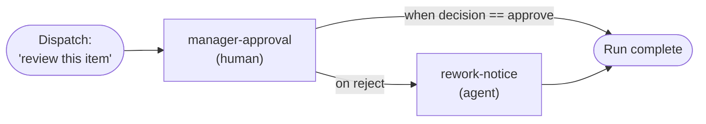

A hands-on guide to building your first workflow on the Approval Engine. By the end you'll have authored a workflow, dispatched a run against a work item, recorded a human decision, and received the outcome.

<Note>
  New to the Approval Engine? Start with the [Overview](/ai/approval-engine/overview) for the mental model: definitions, nodes, edges, executions, steps, and scoping. [Customize Behavior](/ai/approval-engine/customize-behavior) is the patterns and field reference. The [REST API Reference](/api-reference/rest-apis/v2/approval-engine/definitions/create-definition) is the field-level law: when this page and the API Reference disagree, the API Reference wins.
</Note>

## Prerequisites & authentication

**Base URL**

All endpoints are under `https://api.velt.dev/v2/`.

**Required headers on every request**

| Header | Description |
| --- | --- |
| `x-velt-api-key` | Your workspace API key. |
| `x-velt-auth-token` | A short-lived auth token. See [Auth Tokens](/security/auth-tokens). |
| `content-type` | `application/json` |

You do **not** put `apiKey`/`authToken` in the body; they're read from the headers.

**Request / response envelope.** Wrap your payload in `data`; success comes back under `result`, errors under `error`:

```json
// request body
{ "data": { /* endpoint fields */ } }

// success
{ "result": { /* payload */ } }

// error
{ "error": { "message": "Human-readable description", "status": "INVALID_ARGUMENT", "details": {} } }
```

For the examples below, export your credentials once:

```bash
export VELT_API_KEY="ak_live_..."
export VELT_AUTH_TOKEN="at_..."
```

## Build your first workflow

You'll build the smallest workflow that exercises the whole engine: one human approval, where approval finishes the run and a rejection routes to a follow-up step.



### Step 1: Create the definition

A `human` node must declare what happens on rejection: either an `onReject` shorthand or membership in a `loops[]` body. Here we use the `onReject.routeToNodeId` shorthand to send rejections to a follow-up node, and we gate the success edge with `when: decision == 'approve'` so it only fires on approval.

The `when` value is a **JSON-AST string**: the engine parses it as JSON and evaluates it with a safe walker, never as JavaScript. The follow-up node uses the reserved `__mock__` agent id so you can run this end-to-end without registering a real agent (use a real `agentId` in production).

```bash
curl -X POST https://api.velt.dev/v2/workflow/definitions/create \
  -H "x-velt-api-key: $VELT_API_KEY" \
  -H "x-velt-auth-token: $VELT_AUTH_TOKEN" \
  -H "content-type: application/json" \
  -d '{
    "data": {
      "definitionId": "doc-signoff",
      "name": "Document sign-off",
      "scope": { "level": "apiKey" },
      "nodes": [
        {
          "nodeId": "manager-approval",
          "type": "human",
          "config": {
            "reviewers": [{ "userId": "u_manager_01", "mandatory": true }],
            "commentBody": "Please review and approve this document.",
            "onReject": { "routeToNodeId": "rework-notice" }
          }
        },
        {
          "nodeId": "rework-notice",
          "type": "agent",
          "config": { "agentId": "__mock__", "urlPath": "documentUrl" }
        }
      ],
      "edges": [
        {
          "from": "manager-approval",
          "to": "rework-notice",
          "when": "{\"op\":\"eq\",\"args\":[{\"var\":\"output.decision\"},\"reject\"]}"
        }
      ]
    }
  }'
```

A successful create returns a `DefinitionView` with `version: 1` and `status: "active"`. Definitions are linted at write time: cycles, dangling edges, unreachable nodes, and quorum misconfiguration all fail before you ever dispatch. If the engine rejects the definition you'll get `INVALID_ARGUMENT` with a [linter code](/ai/approval-engine/customize-behavior#linter-rules) in the message.

The `onReject.routeToNodeId` shorthand synthesizes the reject-gated edge for you, so you only need to author the explicit approve-side routing. See [Per-human-node `onReject` shorthand](/ai/approval-engine/customize-behavior#per-human-node-onreject-shorthand) for choosing a rejection strategy. Full request shape: [Create Definition](/api-reference/rest-apis/v2/approval-engine/definitions/create-definition).

### Step 2: Dispatch an execution

Dispatch starts a run against a work item. You write one definition per workflow type and reuse it across many dispatches. `triggerContext` is free-form data your nodes and edge expressions can read as `execution.input.*`. Pass an `idempotencyKey` so retries never spawn duplicates.

```bash
curl -X POST https://api.velt.dev/v2/workflow/executions/dispatch \
  -H "x-velt-api-key: $VELT_API_KEY" \
  -H "x-velt-auth-token: $VELT_AUTH_TOKEN" \
  -H "content-type: application/json" \
  -d '{
    "data": {
      "definitionId": "doc-signoff",
      "idempotencyKey": "doc-123-signoff",
      "triggerContext": { "documentUrl": "https://app.acme.com/docs/123" }
    }
  }'
```

Response:

```json
{
  "result": {
    "executionId": "exec_1777374504255_xzy43k9q",
    "correlationId": "corr_...",
    "deduplicated": false
  }
}
```

Keep the `executionId`; it's the handle for everything that follows. (`deduplicated: true` means this was a replay of an earlier dispatch with the same `idempotencyKey`, and you got the original execution back.) Full request shape: [Dispatch Execution](/api-reference/rest-apis/v2/approval-engine/executions/dispatch-execution).

### Step 3: Find the pending step and record a decision

Fetch the execution to see which step is waiting on a human:

```bash
curl -X POST https://api.velt.dev/v2/workflow/executions/get \
  -H "x-velt-api-key: $VELT_API_KEY" \
  -H "x-velt-auth-token: $VELT_AUTH_TOKEN" \
  -H "content-type: application/json" \
  -d '{ "data": { "executionId": "exec_1777374504255_xzy43k9q" } }'
```

Look for a step with `"status": "waiting"` and `"nodeType": "human"`, and grab its `stepId`. In v1 you own the reviewer UI: render the pending step to your user, and when they click approve/reject, call `recordReviewerDecision`:

```bash
curl -X POST https://api.velt.dev/v2/workflow/steps/recordReviewerDecision \
  -H "x-velt-api-key: $VELT_API_KEY" \
  -H "x-velt-auth-token: $VELT_AUTH_TOKEN" \
  -H "content-type: application/json" \
  -d '{
    "data": {
      "executionId": "exec_1777374504255_xzy43k9q",
      "stepId": "step_manager-approval_..._lwofay",
      "reviewerId": "u_manager_01",
      "decision": "approve",
      "reason": "Looks good for launch."
    }
  }'
```

Response:

```json
{ "result": { "recorded": true, "aggregatorStatus": "resolved", "resumeScheduled": true } }
```

`reviewerId` must match a `userId` declared on the node. When all mandatory reviewers approve (or any reviewer rejects), the step resolves and the workflow advances. Recording the same reviewer's decision twice is idempotent (`recorded: false` on replay). Full request shape: [Record Reviewer Decision](/api-reference/rest-apis/v2/approval-engine/steps/record-reviewer-decision).

For blocking agent steps, record the outcome with [Record Agent Resolution](/api-reference/rest-apis/v2/approval-engine/steps/record-agent-resolution) instead.

### Step 4: Get the outcome

You have two complementary ways to learn how the run ends.

**A. Webhook push (real-time).** Pass `webhookUrl` + `webhookSecret` on dispatch and the engine POSTs every externally-visible event to you, signed with HMAC-SHA256:

```json
// add to the dispatch "data"
"webhookUrl": "https://hooks.acme.com/velt/approvals",
"webhookSecret": "whsec_...at-least-16-chars..."
```

Delivery is a POST with a JSON body, a 10s timeout, and no redirects. Headers your receiver sees:

| Header             | What it is                                              |
| ------------------ | ------------------------------------------------------- |
| `x-velt-signature` | `sha256=<hex>`. HMAC-SHA256 of the raw request body.    |
| `x-velt-event-id`  | Stable event ID, unchanged across retries.              |
| `x-velt-attempt`   | 0-based attempt counter.                                |

Verify the signature against the raw request body bytes. Do not re-serialize the parsed JSON object:

```js
const crypto = require('crypto');

function verifyVeltSignature(rawBody, headerValue, secret) {
  const [scheme, hex] = String(headerValue).split('=');
  if (scheme !== 'sha256' || !hex) return false;
  const computed = crypto.createHmac('sha256', secret).update(rawBody, 'utf8').digest('hex');
  const a = Buffer.from(hex, 'hex');
  const b = Buffer.from(computed, 'hex');
  return a.length === b.length && crypto.timingSafeEqual(a, b);
}
```

<Warning>
  `webhookUrl` is validated at the schema boundary and re-checked at delivery time. Scheme must be `https://`. Literal IP hosts in loopback, private (RFC 1918), link-local, or IPv4-mapped-private ranges are rejected. Forbidden hostnames include `localhost`, `metadata.google.internal`, `metadata`, and any `*.internal`. At delivery, DNS resolution is repeated; if any resolved address is private, the request is not sent. Redirects are never followed.
</Warning>

Delivery is **at-least-once** with retries (`2s → 8s → 32s → 2m → 8m`) before dead-lettering. The same `eventId` and `seq` appear on retries, so make your receiver idempotent: dedupe by `eventId` or `(executionId, seq)`. See [Webhook retry policy](/ai/approval-engine/customize-behavior#webhook-retry-policy).

**B. Events polling (catch-up).** Whether or not you use webhooks, you can read the event stream directly. Pass the highest `seq` you've durably stored as `sinceSeq` to get only what's new; it's the recovery path after a missed webhook or an outage:

```bash
curl -X POST https://api.velt.dev/v2/workflow/executions/getEvents \
  -H "x-velt-api-key: $VELT_API_KEY" \
  -H "x-velt-auth-token: $VELT_AUTH_TOKEN" \
  -H "content-type: application/json" \
  -d '{ "data": { "executionId": "exec_1777374504255_xzy43k9q", "sinceSeq": 0 } }'
```

`seq` is monotonic per execution. Only externally-visible event types are returned; internal-only events fill `seq` gaps but are filtered out, so your stream may have non-contiguous `seq` values. That's normal. When you see `execution.completed` (or `execution.failed`), the run is done. You can also pull the current state of any execution at any time with [Get Execution](/api-reference/rest-apis/v2/approval-engine/executions/get-execution). Full request shape: [Get Execution Events](/api-reference/rest-apis/v2/approval-engine/executions/get-execution-events).

<Note>
  **Recommended production setup:** webhooks for liveness, polling as the recovery path.
</Note>

## Putting it together: a realistic workflow

Once the basics click, you compose richer graphs. Here's an AI-assisted parallel review: an agent drafts, then legal and brand review in parallel, and a single publish step fires once both approve:

```json
{
  "data": {
    "definitionId": "marketing-copy-approval",
    "name": "Marketing copy approval",
    "scope": { "level": "apiKey" },
    "nodes": [
      { "nodeId": "agent-draft",   "type": "agent",  "config": { "agentId": "copy-agent-v1",   "urlPath": "documentUrl" } },
      { "nodeId": "human-legal",   "type": "human",  "config": { "reviewers": [{ "userId": "u_legal_01", "mandatory": true }] } },
      { "nodeId": "human-brand",   "type": "human",  "config": { "reviewers": [{ "userId": "u_brand_01", "mandatory": true }] } },
      { "nodeId": "agent-publish", "type": "agent",  "config": { "agentId": "publish-agent-v1", "urlPath": "documentUrl" } }
    ],
    "edges": [
      { "from": "agent-draft", "to": "human-legal" },
      { "from": "agent-draft", "to": "human-brand" },
      { "from": "human-legal", "to": "agent-publish" },
      { "from": "human-brand", "to": "agent-publish" }
    ],
    "groups": [{
      "groupId": "parallel-review",
      "memberNodeIds": ["human-legal", "human-brand"],
      "expectedSteps": 2,
      "quorum": 2,
      "onQuorumMet": "joinOnQuorum"
    }]
  }
}
```

`agent-draft` runs first and fans out to both reviewers. Because the group uses `joinOnQuorum` with `quorum: 2`, `agent-publish` runs exactly once after both approve, not once per approver. Agent nodes run automatically (the engine dispatches the agent and resumes the step when it finishes); human nodes wait for `recordReviewerDecision` as in Step 3. See [Parallel groups and quorum policies](/ai/approval-engine/customize-behavior#parallel-groups-and-quorum-policies).

### How the events play out

<AccordionGroup>
  <Accordion title="Happy path with joinOnQuorum">
    Marketing copy approval: agent drafts, legal and brand approve in parallel, publish agent ships once both approve.

    ```
    1. Create Definition
         → definition with parallel-review group, onQuorumMet: joinOnQuorum

    2. Dispatch Execution
         → executionId returned, status=running
           webhook: execution.dispatched
           webhook: step.completed (agent-draft)
           webhook: step.awaiting-approval (human-legal)
           webhook: step.awaiting-approval (human-brand)

    3. Record Reviewer Decision (u_legal_01, approve)
           webhook: step.completed (human-legal)

    4. Record Reviewer Decision (u_brand_01, approve)
           webhook: step.completed (human-brand)
           webhook: group.quorum-met (parallel-review)
           [engine fires single group fan-out:
            creates step group_parallel-review__to__agent-publish]
           webhook: step.completed (agent-publish, single instance)
           webhook: execution.completed
    ```

    `joinOnQuorum` fires one shared downstream step instead of firing it once per approver.
  </Accordion>

  <Accordion title="Stop-bothering-reviewers with cancelOnQuorum">
    Group with 3 reviewers, `quorum: 2`, `onQuorumMet: cancelOnQuorum`:

    ```
    2 of 3 approve → engine fires:
      webhook: group.quorum-met (parallel-review)
      webhook: step.cancelled (third-reviewer-step)
               data: { actorId: "system:group-quorum", reason: "group-quorum-met" }
    ```

    The two approvers' downstream paths still fan out per edge. The cancelled third reviewer's edges do not fire.
  </Accordion>
</AccordionGroup>

## Going further

Short pointers to the features you'll reach for next. Each links to the decision-level guidance and the field-level contract.

- **Conditional routing (`when` expressions).** Gate any edge with a `when` JSON-AST predicate over `output.*`, `step.*`, and `execution.input.*`. Operators include equality, comparison, boolean and/or/not, regex, includes, startsWith, endsWith, length, isEmpty. → [Edge gating expressions](/ai/approval-engine/customize-behavior#edge-gating-expressions).
- **Parallel groups & quorum.** Declare a `groups[]` entry to run reviewers in parallel under one of three policies: `waitAll` (observability only), `cancelOnQuorum` (stop bothering siblings once enough approve), `joinOnQuorum` (run the successor once after quorum). Use `requiredNodeIds` for "these specific people must approve." → [`onQuorumMet` policies](/ai/approval-engine/customize-behavior#onquorummet-policies) · [Specific-must-approve quorum](/ai/approval-engine/customize-behavior#specific-must-approve-quorum).
- **Rejection handling: shorthand vs. loops.** For one reviewer, `onReject.routeToNodeId` (route away) or `onReject.loopBack` (retry up to N times, then escalate) usually suffice. When multiple parallel reviewers must share one retry budget, or a whole stage must rewind as a unit, declare a top-level `loops[]` region instead. → [Loop regions](/ai/approval-engine/customize-behavior#loop-regions) · [When to use a loop vs. the `onReject` shorthand](/ai/approval-engine/customize-behavior#when-to-use-a-loop-vs-the-onreject-shorthand).
- **SLA timers & escalation.** Set `slaMs` on a node to enforce a deadline; on breach the step becomes `breached` and the engine follows your outgoing edges. **Gotcha:** a node with `slaMs` must have an edge that routes on `status == 'breached'`, or the definition is rejected (`missing-breach-edge`). Agent nodes also have a hard runtime ceiling (`agentMaxRuntimeMs`, default 30 min). → [SLA and breach handling](/ai/approval-engine/customize-behavior#sla-and-breach-handling).
- **Agent nodes.** An agent node requires `agentId` and `urlPath` (a dot-path into `triggerContext` that resolves the URL the agent should act on). The step output exposes `agentExecutionStatus`, `agentResultsSummary`, and a `decision` (`approve` when the agent passed). Some configurations post findings that are resolved via [Record Agent Resolution](/api-reference/rest-apis/v2/approval-engine/steps/record-agent-resolution). → [Agent nodes](/ai/approval-engine/customize-behavior#agent-nodes).
- **Externally-triggered runs & async callbacks.** Beyond dispatching from your backend, external systems can kick off runs or complete long-running steps via the inbound webhook surface. → [Inbound webhook handler](/ai/approval-engine/overview#inbound-webhook-handler).
- **Versioning & scope.** Editing a definition ([Update Definition](/api-reference/rest-apis/v2/approval-engine/definitions/update-definition)) creates a new version; in-flight executions keep running on their pinned version. Scope a definition to a workspace, organization, or document; the most specific match wins. → [Scope](/ai/approval-engine/overview#scope).
- **Cancellation.** Stop a whole run with [Cancel Execution](/api-reference/rest-apis/v2/approval-engine/executions/cancel-execution), or a single step with [Cancel Step](/api-reference/rest-apis/v2/approval-engine/steps/cancel-step). Admins can override a parked step with [Resolve Step](/api-reference/rest-apis/v2/approval-engine/steps/resolve-step).

## Events you'll receive

These event types are delivered via webhook and returned from [Get Execution Events](/api-reference/rest-apis/v2/approval-engine/executions/get-execution-events):

| Event | When |
| --- | --- |
| `execution.dispatched` | Run created; first step(s) scheduled. |
| `step.awaiting-approval` | A human (or blocking-agent) step entered `waiting`. |
| `step.completed` | A step finished successfully (human resumes include `decision`). |
| `step.failed` | A step failed after exhausting its retry budget. |
| `step.breached` | A step missed its SLA deadline. |
| `step.cancelled` | A step was cancelled (directly or by a quorum side effect). |
| `group.quorum-met` | A parallel group's approval threshold was first met. |
| `execution.completed` | All steps terminal, no unhandled failure. |
| `execution.failed` | A blocking step failed/breached with no recovery edge. |
| `execution.cancelled` | The run was cancelled. |

See the full payload shape and `data` fields in the [Event reference](/ai/approval-engine/customize-behavior#event-reference).

## Errors & troubleshooting

Errors use the standard envelope with a gRPC-style status code:

| Code | Meaning |
| --- | --- |
| `INVALID_ARGUMENT` | Request failed schema or linter validation. |
| `UNAUTHENTICATED` | Missing/invalid `x-velt-auth-token`. |
| `PERMISSION_DENIED` | Token valid but lacks the required scope (e.g. admin-only `/steps/resolve`). |
| `NOT_FOUND` | Unknown `executionId`, `definitionId`, or `stepId`. |
| `ALREADY_EXISTS` | A definition with that `definitionId` already exists. |
| `FAILED_PRECONDITION` | State/lock violation (e.g. resolving a step that isn't `waiting`, deleting a definition with in-flight runs). |
| `RESOURCE_EXHAUSTED` | Rate limited; back off and retry (safe with an `idempotencyKey`). |

Most common "the engine rejected my definition" causes (all `INVALID_ARGUMENT`, with a code in the message):

- **Human node missing a reject path:** add `onReject`, or include the node in a `loops[]` body.
- **`missing-breach-edge`:** a node has `slaMs` but no edge routes on `status == 'breached'`.
- **`when` written as JavaScript:** it must be a JSON-AST string, not `"output.decision == 'approve'"`.
- **Group quorum > `expectedSteps`**, or a non-blocking agent placed in a quorum group (it has no `decision`, so quorum can never be met).

See the full list under [Linter rules](/ai/approval-engine/customize-behavior#linter-rules) and [Canonical codes](/ai/approval-engine/customize-behavior#canonical-codes).

## Limitations in v1

- **No visual builder:** you author definitions as JSON.
- **You host the reviewer UI:** render the pending step and call `recordReviewerDecision`; a native comment-reply approval UX is not yet a v1 promise.
- **`webhook` nodes are deferred:** the type validates in a definition, but the runtime handler isn't enabled in v1. (This is distinct from the inbound [`approvalwebhookhandler`](/ai/approval-engine/overview#inbound-webhook-handler), which *is* available for external systems to trigger or call back into runs.)
- **No in-flight definition migration:** editing a definition only affects new runs; in-flight ones finish on their pinned version.

## Next steps

<CardGroup cols={2}>
  <Card title="Customize Behavior" icon="sliders" href="/ai/approval-engine/customize-behavior">
    Node configuration, edge expressions, parallel groups, SLAs, linter rules, the event catalog, and the error vocabulary.
  </Card>

  <Card title="REST API Reference" icon="code" href="/api-reference/rest-apis/v2/approval-engine/definitions/create-definition">
    All endpoints organized into Definitions, Executions, and Steps, with full request and response schemas.
  </Card>
</CardGroup>
