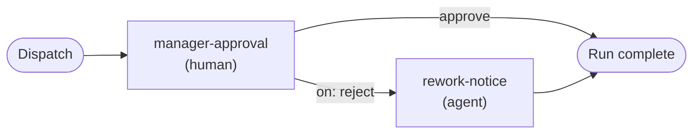

By the end of this page you will have authored a workflow, started a run, recorded a human decision, and received the result.

<Note>
  New here? Read the [Overview](/ai/approval-engine/overview) first for the mental model. [Customize Behavior](/ai/approval-engine/customize-behavior) is the field reference.
</Note>

## Before you start

All endpoints are under `https://api.velt.dev/v2/`. Every request needs three headers:

| Header | Value |
| --- | --- |
| `x-velt-api-key` | Your workspace API key. |
| `x-velt-auth-token` | A short-lived auth token. See [Auth Tokens](/security/auth-tokens). |
| `content-type` | `application/json` |

Never put `apiKey` or `authToken` in the body. They are read from the headers.

Wrap your payload in `data`. Success comes back under `result`, errors under `error`:

```json
// request
{ "data": { /* endpoint fields */ } }

// success
{ "result": { /* payload */ } }

// error
{ "error": { "message": "...", "status": "INVALID_ARGUMENT", "details": {} } }
```

Export your credentials once so the examples below run as written:

```bash
export VELT_API_KEY="ak_live_..."
export VELT_AUTH_TOKEN="at_..."
```

## Build your first workflow

You will build the smallest workflow that exercises the whole engine: one human approval. Approving finishes the run. Rejecting routes to a follow-up step.


```mermaid
flowchart LR
    Start([Dispatch]) --> M["manager-approval<br/>(human)"]
    M -->|approve| Done([Run complete])
    M -->|"on: reject"| RW["rework-notice<br/>(agent)"]
    RW --> Done
```

### Step 1: Create the definition

Every `human` node needs a reject path, so give it an outgoing `on: "reject"` edge. Approving has no outgoing edge here, so the run completes after the approval.

The follow-up node uses the reserved `__mock__` agent id so you can run this end to end without registering a real agent. Use a real `agentId` in production.

```bash
curl -X POST https://api.velt.dev/v2/workflow/definitions/create \
  -H "x-velt-api-key: $VELT_API_KEY" \
  -H "x-velt-auth-token: $VELT_AUTH_TOKEN" \
  -H "content-type: application/json" \
  -d '{
    "data": {
      "definitionId": "doc-signoff",
      "name": "Document sign-off",
      "scope": { "level": "apiKey" },
      "nodes": [
        {
          "nodeId": "manager-approval",
          "type": "human",
          "config": {
            "reviewers": [{ "userId": "u_manager_01", "mandatory": true }],
            "commentBody": "Please review and approve this document."
          }
        },
        {
          "nodeId": "rework-notice",
          "type": "agent",
          "config": { "agentId": "__mock__", "urlPath": "documentUrl" }
        }
      ],
      "edges": [
        { "from": "manager-approval", "to": "rework-notice", "on": "reject" }
      ]
    }
  }'
```

A successful create returns a `DefinitionView` with `version: 1` and `status: "active"`.

The engine validates the graph at write time. Schema errors, edge-contract errors, cycles, dangling edges, unreachable nodes, and bad quorum settings all fail here rather than at run time. A rejected definition returns `INVALID_ARGUMENT` with the validation key in the message.

<Tip>
  Two rules catch most first-time authors. A `human` node needs an outgoing `on: "reject"` edge (`APPROVAL_HUMAN_NODE_REQUIRES_REJECT_PATH`). An `agent` node needs either `url` or `urlPath` (`APPROVAL_AGENT_NODE_REQUIRES_URL_OR_URLPATH`).
</Tip>

Full request shape: [Create Definition](/api-reference/rest-apis/v2/approval-engine/definitions/create-definition).

### Step 2: Dispatch an execution

Dispatch starts a run against one work item. Write the definition once and reuse it across many dispatches.

`triggerContext` is free-form data your nodes and edge conditions read as `execution.input.*`. Pass an `idempotencyKey` so retries never spawn duplicates.

```bash
curl -X POST https://api.velt.dev/v2/workflow/executions/dispatch \
  -H "x-velt-api-key: $VELT_API_KEY" \
  -H "x-velt-auth-token: $VELT_AUTH_TOKEN" \
  -H "content-type: application/json" \
  -d '{
    "data": {
      "definitionId": "doc-signoff",
      "idempotencyKey": "doc-123-signoff",
      "triggerContext": { "documentUrl": "https://app.acme.com/docs/123" }
    }
  }'
```

```json
{
  "result": {
    "executionId": "exec_1777374504255_xzy43k9q",
    "correlationId": "corr_...",
    "deduplicated": false
  }
}
```

Keep the `executionId`. It is the handle for everything that follows. `deduplicated: true` means you replayed an earlier dispatch with the same `idempotencyKey` and got the original run back.

Full request shape: [Dispatch Execution](/api-reference/rest-apis/v2/approval-engine/executions/dispatch-execution).

### Step 3: Record a decision

Fetch the execution to find the step waiting on a human:

```bash
curl -X POST https://api.velt.dev/v2/workflow/executions/get \
  -H "x-velt-api-key: $VELT_API_KEY" \
  -H "x-velt-auth-token: $VELT_AUTH_TOKEN" \
  -H "content-type: application/json" \
  -d '{ "data": { "executionId": "exec_1777374504255_xzy43k9q" } }'
```

Look for a step with `"status": "waiting"` and `"nodeType": "human"`, then grab its `stepId`.

You own the reviewer UI in beta. Render the waiting step to your user, and when they click approve or reject, call `recordReviewerDecision`:

```bash
curl -X POST https://api.velt.dev/v2/workflow/steps/recordReviewerDecision \
  -H "x-velt-api-key: $VELT_API_KEY" \
  -H "x-velt-auth-token: $VELT_AUTH_TOKEN" \
  -H "content-type: application/json" \
  -d '{
    "data": {
      "executionId": "exec_1777374504255_xzy43k9q",
      "stepId": "step_manager-approval_..._lwofay",
      "reviewerId": "u_manager_01",
      "decision": "approve",
      "reason": "Looks good for launch."
    }
  }'
```

```json
{ "result": { "recorded": true, "aggregatorStatus": "resolved", "resumeScheduled": true } }
```

`reviewerId` must match a `userId` declared on the node. The step resolves and the workflow advances when every mandatory reviewer approves, or when any reviewer rejects. Recording the same reviewer's decision twice is idempotent and returns `recorded: false`.

Full request shape: [Record Reviewer Decision](/api-reference/rest-apis/v2/approval-engine/steps/record-reviewer-decision).

### Step 4: Get the outcome

You have two ways to learn how the run ends. Use both in production: webhooks for liveness, polling for recovery.

#### A. Webhooks, for real time

Pass `webhookUrl` and `webhookSecret` on dispatch. The engine POSTs every externally-visible event to you, signed with HMAC-SHA256:

```json
// add to the dispatch "data"
"webhookUrl": "https://hooks.acme.com/velt/approvals",
"webhookSecret": "whsec_...at-least-16-chars..."
```

Each delivery is a POST with a 10s timeout and no redirects. Your receiver sees:

| Header | What it is |
| --- | --- |
| `x-velt-signature` | `sha256=<hex>`. HMAC-SHA256 of the raw request body. |
| `x-velt-event-id` | Stable event id, unchanged across retries. |
| `x-velt-attempt` | 0-based attempt counter. |

Verify the signature against the raw request body bytes. Do not re-serialize the parsed JSON:

```js
const crypto = require('crypto');

function verifyVeltSignature(rawBody, headerValue, secret) {
  const [scheme, hex] = String(headerValue).split('=');
  if (scheme !== 'sha256' || !hex) return false;
  const computed = crypto.createHmac('sha256', secret).update(rawBody, 'utf8').digest('hex');
  const a = Buffer.from(hex, 'hex');
  const b = Buffer.from(computed, 'hex');
  return a.length === b.length && crypto.timingSafeEqual(a, b);
}
```

Delivery is at-least-once, retried at `2s → 8s → 32s → 2m → 8m` before dead-lettering. The same `eventId` and `seq` appear on retries, so **make your receiver idempotent**: dedupe on `eventId` or `(executionId, seq)`.

<Warning>
  `webhookUrl` must use `https`. Loopback, private (RFC 1918), and link-local hosts are rejected, as are `localhost`, `metadata.google.internal`, `metadata`, and any `*.internal` hostname. DNS is re-resolved at delivery time, and redirects are never followed.
</Warning>

To send the same events to one receiver for every run of a definition, set `webhookConfig` on the definition instead. See [Webhook delivery](/ai/approval-engine/customize-behavior#webhook-delivery).

#### B. Event polling, for catch-up

You can read the event stream directly whether or not you use webhooks. Pass the highest `seq` you have durably stored as `sinceSeq` to get only what is new:

```bash
curl -X POST https://api.velt.dev/v2/workflow/executions/getEvents \
  -H "x-velt-api-key: $VELT_API_KEY" \
  -H "x-velt-auth-token: $VELT_AUTH_TOKEN" \
  -H "content-type: application/json" \
  -d '{ "data": { "executionId": "exec_1777374504255_xzy43k9q", "sinceSeq": 0 } }'
```

`seq` is monotonic per execution. Only external event types are returned, so your stream may have gaps in `seq`. That is normal. When you see `execution.completed` or `execution.failed`, the run is done.

Full request shape: [Get Execution Events](/api-reference/rest-apis/v2/approval-engine/executions/get-execution-events).

## Events you will receive

| Event | When |
| --- | --- |
| `execution.dispatched` | Run created and the first steps scheduled. |
| `step.awaiting-approval` | A step entered `waiting`: a human step, a running agent step, or an async webhook step. |
| `step.completed` | A step finished successfully. Human resumes include `decision`. |
| `step.failed` | A step failed after exhausting its retry budget. |
| `step.breached` | A step missed its SLA deadline. |
| `step.cancelled` | A step was cancelled directly or by a quorum side effect. |
| `group.quorum-met` | A parallel group's approval threshold was first met. |
| `loop.iteration-started` | A revision loop started another iteration. |
| `loop.exhausted` | A revision loop hit its `maxIterations` cap. |
| `execution.completed` | All steps terminal, no unhandled failure. |
| `execution.failed` | A blocking step failed or breached with no recovery edge. |
| `execution.cancelled` | The run was cancelled. |

Payload shapes are in the [Event reference](/ai/approval-engine/customize-behavior#event-reference).

## A realistic workflow

Once the basics click, you compose richer graphs. Here an agent drafts, legal and brand review in parallel, and a single publish step fires once both approve:

```json
{
  "data": {
    "definitionId": "marketing-copy-approval",
    "name": "Marketing copy approval",
    "scope": { "level": "apiKey" },
    "nodes": [
      { "nodeId": "agent-draft",   "type": "agent", "config": { "agentId": "copy-agent-v1",    "urlPath": "documentUrl" } },
      { "nodeId": "human-legal",   "type": "human", "config": { "reviewers": [{ "userId": "u_legal_01", "mandatory": true }] } },
      { "nodeId": "human-brand",   "type": "human", "config": { "reviewers": [{ "userId": "u_brand_01", "mandatory": true }] } },
      { "nodeId": "agent-publish", "type": "agent", "config": { "agentId": "publish-agent-v1", "urlPath": "documentUrl" } }
    ],
    "edges": [
      { "from": "agent-draft", "to": "human-legal" },
      { "from": "agent-draft", "to": "human-brand" },
      { "from": "human-legal", "to": "agent-publish" },
      { "from": "human-brand", "to": "agent-publish" },
      { "from": { "kind": "group", "groupId": "parallel-review" }, "to": "agent-draft", "on": "reject", "loop": { "maxIterations": 3 } }
    ],
    "groups": [{
      "groupId": "parallel-review",
      "memberNodeIds": ["human-legal", "human-brand"],
      "expectedSteps": 2,
      "quorum": 2,
      "onQuorumMet": "joinOnQuorum"
    }]
  }
}
```

`agent-draft` runs first and fans out to both reviewers. Because the group uses `joinOnQuorum` with `quorum: 2`, `agent-publish` runs exactly once after both approve, not once per approver.

The reject back-edge from the group is required, not decorative. Every `human` node needs a reject route, including group members. It also makes the workflow useful: if either reviewer rejects, the work loops back to `agent-draft` for up to 3 revisions. See [Parallel groups](/ai/approval-engine/customize-behavior#parallel-groups-and-quorum-policies).

<AccordionGroup>
  <Accordion title="How the events play out">
    ```
    1. Create Definition
         → definition with parallel-review group, onQuorumMet: joinOnQuorum

    2. Dispatch Execution
         → executionId returned, status=running
           execution.dispatched
           step.completed (agent-draft)
           step.awaiting-approval (human-legal)
           step.awaiting-approval (human-brand)

    3. Record Reviewer Decision (u_legal_01, approve)
           step.completed (human-legal)

    4. Record Reviewer Decision (u_brand_01, approve)
           step.completed (human-brand)
           group.quorum-met (parallel-review)
           step.completed (agent-publish, single instance)
           execution.completed
    ```
  </Accordion>

  <Accordion title="Stopping reviewers early with cancelOnQuorum">
    A group of 3 reviewers with `quorum: 2` and `onQuorumMet: "cancelOnQuorum"`:

    ```
    2 of 3 approve → engine fires:
      group.quorum-met (parallel-review)
      step.cancelled (third-reviewer-step)
               data: { actorId: "system:group-quorum", reason: "group-quorum-met" }
    ```

    The two approvers' downstream paths still fan out. The cancelled reviewer's edges do not fire.
  </Accordion>
</AccordionGroup>

## Start runs without calling dispatch

You do not have to call the dispatch API. Add a `triggers[]` entry to a definition and the engine starts runs for you:

- **[Inbound webhook](/ai/approval-engine/customize-behavior#inbound-webhook-trigger):** an external system POSTs to the engine. GitHub, Vercel, and custom signature presets are built in.
- **[Cron schedule](/ai/approval-engine/customize-behavior#scheduled-cron-trigger):** a cron expression starts a run on a cadence.
- **[Installed app](/ai/approval-engine/customize-behavior#app-trigger):** connect the Velt GitHub App or Vercel Integration once, then events route to your workflows automatically.

## Common errors

| Code | Meaning |
| --- | --- |
| `INVALID_ARGUMENT` | The request failed schema or graph validation. The message names the rule. |
| `UNAUTHENTICATED` | Missing or invalid `x-velt-auth-token`. |
| `PERMISSION_DENIED` | The token is valid but lacks the required scope. |
| `NOT_FOUND` | Unknown `executionId`, `definitionId`, or `stepId`. |
| `ALREADY_EXISTS` | An active definition already uses that `definitionId`. |
| `FAILED_PRECONDITION` | State violation, such as resolving a step that is not `waiting`. |
| `RESOURCE_EXHAUSTED` | Rate limited. Back off and retry, which is safe with an `idempotencyKey`. |

The four most common reasons the engine rejects a definition:

- **`APPROVAL_HUMAN_NODE_REQUIRES_REJECT_PATH`:** a human node has no outgoing `on: "reject"` edge.
- **`APPROVAL_AGENT_NODE_REQUIRES_URL_OR_URLPATH`:** an agent node has neither `url` nor `urlPath`.
- **`missing-breach-edge`:** a node sets `slaMs` but nothing routes on a breach.
- **`when` written as JavaScript:** it must be a JSON-AST string, not `"output.decision == 'approve'"`.

See [Linter rules](/ai/approval-engine/customize-behavior#linter-rules) for the full list.

## Next steps

<CardGroup cols={2}>
  <Card title="Customize Behavior" icon="sliders" href="/ai/approval-engine/customize-behavior">
    Node config, edge routing, triggers, quorum, SLAs, events, and errors.
  </Card>

  <Card title="REST API Reference" icon="code" href="/api-reference/rest-apis/v2/approval-engine/definitions/create-definition">
    Definitions, Executions, and Steps with full schemas.
  </Card>
</CardGroup>
