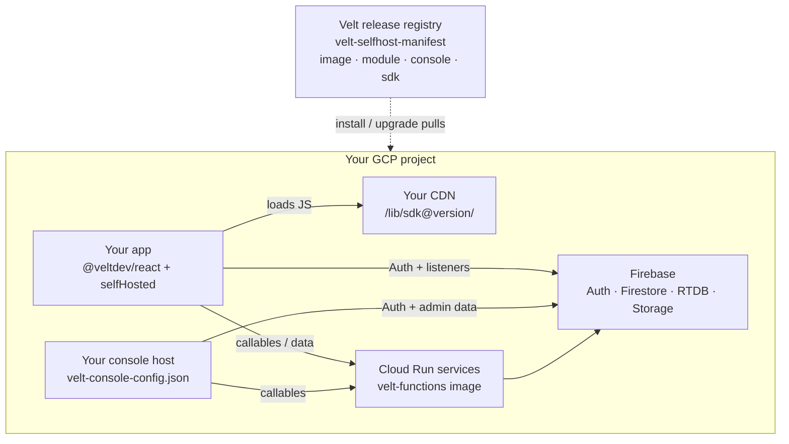

Velt's SaaS product runs on Velt-operated GCP: Cloud Functions, Firestore/RTDB, the hosted console at `console.velt.dev`, and the SDK from `cdn.velt.dev`. **Full self-hosting** moves that entire stack into a cloud project you own.

| Piece | What you run | What you stop calling |
| --- | --- | --- |
| **Backend** | Signed container on Cloud Run (Terraform), your Firebase project, your secrets | `api.velt.dev`, `*.cloudfunctions.net` on Velt projects |
| **Console** | Static admin UI on your host, config pointing at your backend | `console.velt.dev` |
| **SDK** | `@veltdev/sdk` files on your CDN + `config.selfHosted` in the app | `cdn.velt.dev` for code; Velt backends for data |

When finished, your app and admin surface make **no** requests to `velt.dev` or Velt-owned hosts. Data, auth, and admin stay inside your tenancy.

You consume releases through a single signed **umbrella manifest** (`velt-selfhost-manifest`) that pins backend image + Terraform module, console bundle, and the SDK version this release was tested with. You never hand-pick mismatched component versions.

## Full vs partial self-hosting

Velt offers two different things under the word "self-hosting", and they solve different problems.

**Partial self-hosting** keeps Velt's managed backend and moves only your user-generated content and PII into your own storage. You register data providers, Velt stores the structural non-PII data (IDs, document and organization references, locations, statuses, timestamps), and your backend stores the content. It is an application-level integration with no infrastructure to run.

**Full self-hosting** moves the entire stack. There is no Velt-operated component left in the runtime path.

| | Partial self-hosting | Full self-hosting |
| --- | --- | --- |
| **What moves to you** | User content and PII, through data providers | Backend, console, SDK hosting, and all data |
| **Who runs the backend** | Velt | You, on your own GCP project |
| **What you set up** | Data provider callbacks or endpoints in your app | GCP project, Terraform, Firebase, console host, CDN |
| **Requests to Velt hosts** | Yes, for the collaboration backend | None |
| **Where to start** | [Partial self-hosting](/self-hosting/partial/overview) | [Get Started on GCP](/self-hosting/full/gcp/overview) |

## Core concepts

| Concept | What it is |
| --- | --- |
| **Umbrella release** | A versioned binding of backend + console + SDK, published as `velt-selfhost-manifest:<X.Y.Z>` (and `:latest`). One number (`selfHostVersion`) is what you install and upgrade. |
| **Signed manifest** | Cosign-signed JSON. Trust root for the release: it pins image digest, module archive sha256, console sha256, SDK sha256. Always verify by digest, never trust a mutable tag alone. |
| **Backend image** | One container (`velt-functions`) serving many Cloud Run services; `FUNCTION_TARGET` selects the export. Image and Terraform **module always upgrade together**. |
| **Deployment profile** | Curated feature set (`core`, `core+recording`, `core+ai+agents`, `full`) plus optional opt-in modules. Terraform provisions only that closure. |
| **`enabledModules`** | Resolved module list written into `velt-deployment-profile.json`. Console and SDK both honor it, hiding or inert-sentinelling features that aren't deployed. |
| **`config.selfHosted`** | App-side object that repoints every SDK endpoint at your deployment. Generated during install, so don't hand-type URLs. |
| **Strict mode** | `selfHosted.strict: true`. Any endpoint you didn't inject resolves to an inert `velt://self-hosted-disabled/…` sentinel instead of falling back to Velt SaaS. Required for zero-egress. |
| **State file** | `velt-selfhost-state.json`, the resume contract for install/upgrade agents and humans. Records inputs, phase status, and artifact paths (not secret values). |

## Architecture

**Invariant:** after acceptance, DevTools Network on the app and the console show **no** requests to `cdn.velt.dev`, `console.velt.dev`, `api.velt.dev`, or other Velt-owned hosts.

## What's included

### Always on (`core`)

Auth/identity, data plane, workspace control plane, notifications pipeline, agents runtime, analytics/debugger backends, console **backend** handlers, and index converge tooling. This is everything needed for the collaboration product plus the admin API on a self-hosted stack.

### Curated add-ons (pick a profile or opt in)

| Module | Typical need |
| --- | --- |
| `rest-api` | Customer-facing `*apibe` REST surface, GDPR workers, bulk folder moves |
| `recorder-media` | Recording / Whisper / screenshots |
| `ai` | AI chat / completion Cloud Functions (BYO LLM keys) |
| `huddle-webrtc` | Huddle / TURN (`getIceServers`) |
| `integrations-workflow` | Workflow engine + third-party connectors (opt-in) |
| `migrations` | Operational migration tooling (off by default; recommended for full console ops) |

Exact profile compositions: [Reference, Deployment profiles](/self-hosting/full/gcp/reference#deployment-profiles).

Features whose modules aren't in `enabledModules` are gated in the console UI and inert-sentinelled in the SDK under strict mode. Self-host console builds also strip SaaS-only telemetry.

## Security and trust

1. **Verify the manifest** with `cosign` against the GitHub Actions OIDC identity before any pull of image, module, console, or SDK pins.
2. **Pin the image by digest** in your registry and in Terraform. Tags move; digests don't.
3. **Re-scan the image** in your tenancy (Phase 1.5) and diff against the manifest's signed `knownFindings`. Fixable CRITICAL/HIGH findings are never "accepted".
4. **Secrets:** crypto keys (`PLUGIN_CRYPTO_*`, `JWT_SECRET_KEY`) plus your Gemini and Anthropic API keys must be real values you control (required even on `core`). Optional Twilio and other BYO keys apply when those modules are enabled. Velt SaaS analytics/OAuth placeholders are auto-seeded so Cloud Run can start; replace OAuth placeholders with *your* app credentials before enabling an integration.
5. **Zero-egress proof** is part of acceptance. Treat residual `velt.dev` calls as a failed install.

Details: [Reference, Trust model](/self-hosting/full/gcp/reference#trust-model).

## Limitations

- **GCP + Firebase only.** Portable and non-Firebase backends are out of scope today.
- **Human steps remain:** link a billing account on the GCP project, create the OAuth client, sign off the infosec scan, set up DNS (if custom domains), and complete the first console sign-in.
- **Install and upgrade guides are evergreen.** Version-specific pins always come from the signed manifest at run time, so don't bake component versions into runbooks.

## Supported clouds

| Cloud | Status | Guide |
| --- | --- | --- |
| GCP + Firebase | Available | [Get Started on GCP](/self-hosting/full/gcp/overview) |
| AWS | Closed beta | [AWS](/self-hosting/full/aws) |
| Azure | Closed beta | [Azure](/self-hosting/full/azure) |

The concepts on this page apply to every cloud. The umbrella release, signed manifest, deployment profiles, and strict mode do not change per platform.

## Next steps

<CardGroup cols={2}>
  <Card title="Get Started on GCP" icon="rocket" href="/self-hosting/full/gcp/overview">
    Prerequisites, the inputs you decide once, and how to hand the install guide to your coding agent.
  </Card>
  <Card title="Reference" icon="book" href="/self-hosting/full/gcp/reference">
    Manifest schema, profiles, config shapes, and trust verification.
  </Card>
</CardGroup>
